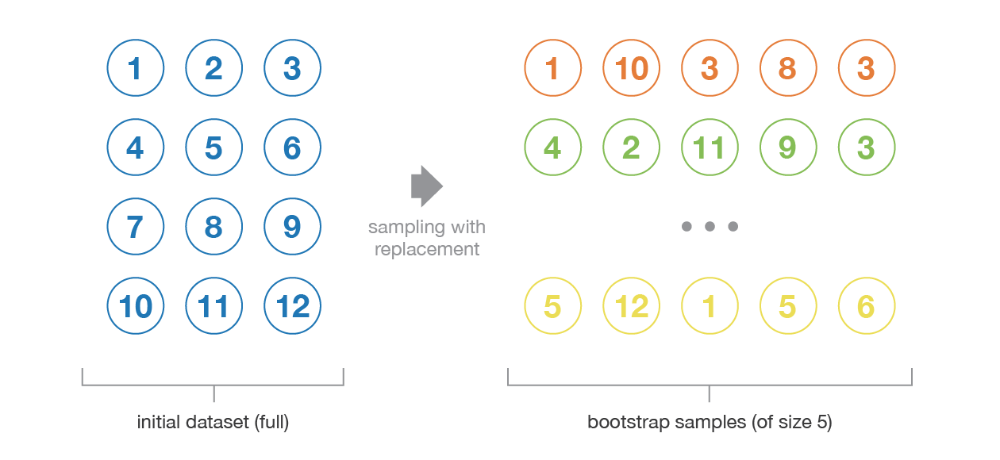
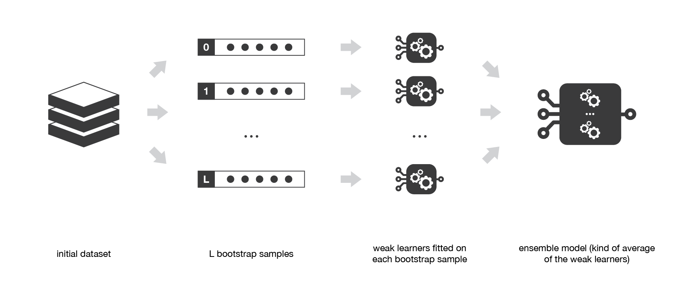
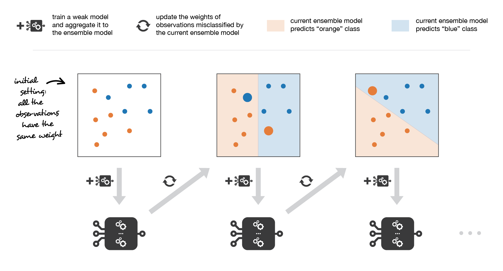
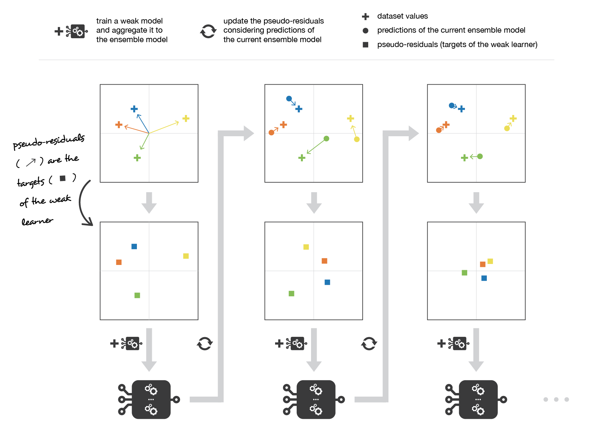
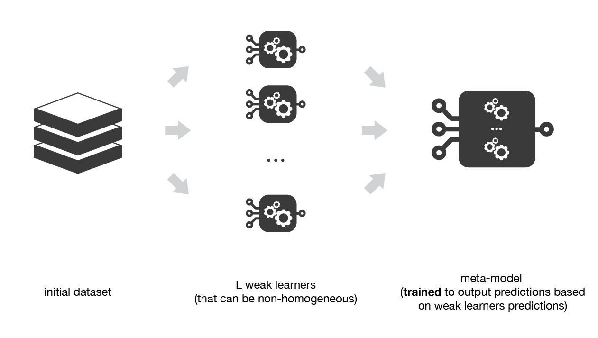

# Ensemble methods: bagging boosting and stacking

> <https://towardsdatascience.com/ensemble-methods-bagging-boosting-and-stacking-c9214a10a205>

## Overview

When weak models are correctly combined, we can obtain more accurate and/or robust models.

**Weak models** perform not so well by themselves either because they have a high `bias` or because they have too much `variance` to be robust.

We will aggregate `homogeneous` weak models that are trained in different ways or `heterogeneous` weak models that use different type of base learning algorithms.

There are three major kinds of meta-algorithm that aims at combining week models:

- **bagging**, often consider `homogeneous` weak models, learns them `independently` from each other in parrallel and combiens them following some kind of deterministic averaging process

- **boosting**. that often considers `homogeneous` weak models, learns them `sequentially` in a very adaptative way (a base model depends on the previous model) and combiens them following a deterministic strategy

- **stacking**, that often considers `hetergeneous` weak models, learns them `independently` and combines them by `training a meta-model` to output a prediction based on the different weak models predictions

Very roughly, we can say that bagging will mainly focus at getting an **ensemble** model with `less variance` than its components whereas **boosting** and **stacking** will mainly try to produce strong models less `biased` than their components (even if variance can also be reduced).

## Bagging

Bagging aims at producting an ensemble model that is `more robust` than the individual models composing it.

**Bootstrapping** is a statistical technique consisting in generatin $B$ samples (called bootstrap samples) from an initial dataset of size $N$ by randomly drawing `with replacement` $B$ observations.

- The size $N$ of the initial dataset should be large enough to capture most of the complexity of the underlying distribution so that sampling from the dataset is a good approximation of sampling from the real distribution (`representativity`)

- The size $N$ of the dataset should be large enough compared to the size $B$ of the bootstrap samples so that samples are not too much correlated (`independence`)

The idea of **Bagging** is then simple: we want to fit several independent models and "average" their predictions in order to obtain a model with a lower variance.

- First, we create multiple bootstrap samples so that each new bootstrap sample will act as another (almost) independent dataset drawn from true distribution.
    $$
    \{z^1_1,z^1_2,...,z^1_B\},\{z^2_1,z^2_2,...,z^2_B\},...,\{z^L_1,z^L_2,...,z^L_B\} \\
    $$

- Then, we cant fit $L$ almost independent weak models (one on each dataset)
    $$
    w_1(.),w_2(.),...,w_L(.)
    $$

- And then aggregate them into some kind of averaging process in order to get an ensemble model with lower variance
    $$
    s_L(.) = 1 / L \sum^L_{l = 1}w_l(.)
    $$

## Boosting

Boosting methods work in the same spirits as bagging methods: we build a family of models that are aggregated to obtain a strong learner that performs better. Unlike bagging that learns models in parallel, boosting fits sequentially multiple weak models in a very adaptative way: each model focus its effort on `the most difficult observations` to fit up to now.

**Adaptative boosting** tries to define ensemble model as a weighted sum of $L$ weak models
$$
s_L(.) = \sum^L_{l = 1}c_l \times w_l(.)
$$
Finding the best ensemble with this form is a difficult optimization problem. Instead, we add the weak models one by one, looking at each iteration for the best possible pair ($c_l$, $w_l(.)$) to add to the current ensemble model.
$$
s_l(.) = s_{l - 1}(.) + c_l \times w_l(.) \\
(c_l,w_l(.)) = \argmin_{c, w(.)}E(s_{l-1}(.) + c\times w(.))
$$

**Gradient boosting** also uses a weithed sum of $L$ weak models. The main difference with adaptative boosting is in the definition of the sequential optimization process. Indeed, gradient boosting `casts the problem into a gradient descent one`
$$
s_l(.) = s_{l - 1}(.) - c_l \times \nabla_{s_{l - 1}}E(s_{l - 1})(.)
$$

## Stacking

The idea of stacking is to learn several different models and combiend them by `training a meta-model` to output predictions based on the multiple predictions returned by the weak models. One thing should be noticed is that the predictions on data that have been used for the training of the weak models are `not relevant for the training of the meta-model`, we can follow some kind of "k-fold cross-training" approach to overcome this limitation.

